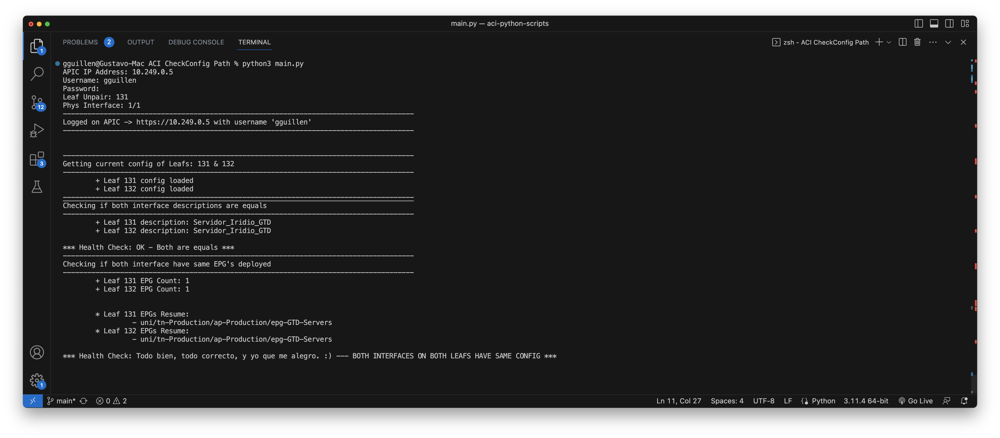

# ACI CheckConfig Path

Permite ver los EPG aplicado en la interfaz y validar que su par de Leaf, tenga los mismos EPG configurados.

- main.py se ejecuta el script preguntando user, pass, leaf e interfaz posterior revisara la configuración y validara que todo esta correcto.

    
## Change Log

-  First Commit