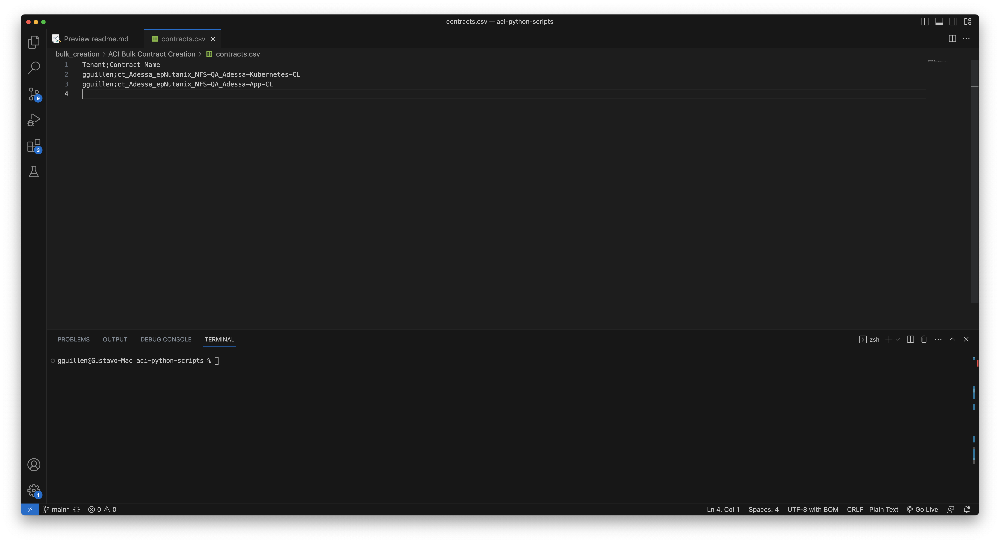

# ACI Bulk Contract Creation

Script que permite crear contractos de manera masiva.

- contracts.py permite crear los contractos.

- apply_contracts.py permite aplicar el contracto a un EPG como consumer y provider.
  - Se requiere modificar el URL aplicarlo a una URL.
- contracts.csv es el archivo donde se especifica la cantidad de contractos a crear, requiere de tenant y nombre de contracto.

    
## Change Log

-  First Commit